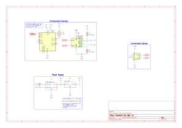
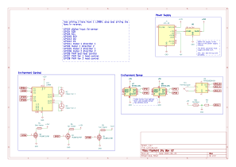
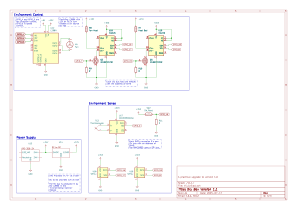

# Filament Dry Box

## Components

- Intake Fan with Heater:
    - 12V DC (8.33A)
    - PTC: 12V AC/DC
    - POWER: 100W
    - SKU: JYA01663
- Microcontroller:
    - ESP32 WROOM with OLED
- Dual Channel Relay:
    - HL-52S
- H-Bridge DC Speed Controller:
    - L298N
- Environment sensor:
    - SHT21 
- Heat Bed:
    - 24V DC
    - POWER: 260W
- DC/DC Converter:
    - 24V to 12V 10A
- Power Supply AC to DC:
    - LRS 350 24

## Control

The heat bed and fan heat and powered via relays and thus primary can be turned on or off.
Esphome "slow pwm" has been used to allow control of the heating elements via a pwm signal.

The intake fan speed is controlled with half of an H-bridge and there for is controlled via a PWM signal.

All of these devices are controlled together with a PID controller to control the interior temperature according to the enviroment sensor.

## Schematic

# Wish List

- second intake fan
- insulated box

## Components

2 heated fans + heat bed = 460W

- [SHT31-D](https://www.adafruit.com/product/2857):
    - i2c address can be changed so two devices can be on one i2c bus
- Intake Fan with Heater:
    - 12V DC (8.33A)
    - PTC: 12V AC/DC
    - POWER: 100W
    - SKU: JYA01663
- H-Bridge DC Speed Controller:
    - L298N
- Heat Bed:
    - 24V DC
    - POWER: 260W
- [N-channel power MOSFET](https://www.adafruit.com/product/355):
    - switch 30V/60A
    - up to 15A without a heatsink 

## Schematic

# V1.1

A practical next step with components on hand, upgrading the capabilities of the dry box and allowing new control capabilites to be developed.

## Components

- INA226:
    - limited by available address
    - current sensor
    - place one on each ic2 bus
        - 0x41
        - 0x44
        - 0x45
    - monitor:
        - fan heater
        - bed heater
- reed switch:
    - lid position sensor
- HTU21X:
    - create second i2c bus
    - external environmental sensor
- Use the existing L298N as a full H-bridge 
- IRLB8721 30V/60A:
    - N channel power MOSFET
    - use 1 per heater
- max31855:
    - thermocouple amplifier
    - heat bed temperature sensor
    - type k

